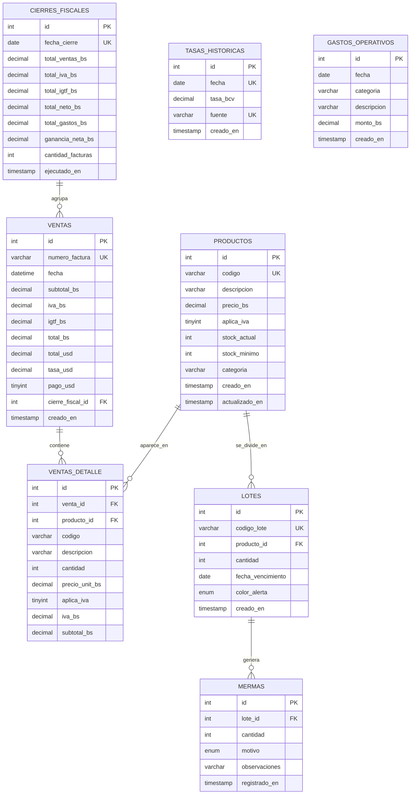

# Diagrama Entidad–Relación — SIGA (`siga_db`)

> Generado a partir del esquema real implementado en [`siga/schema.sql`](../siga/schema.sql),
> por lo que **corresponde a la versión implementada**. Si el diagrama original
> del equipo difiere, la fuente válida es `schema.sql`.
>
> El diagrama está en sintaxis **Mermaid**; GitHub lo renderiza automáticamente.

## Notas del modelo

- `TASAS_HISTORICAS` y `GASTOS_OPERATIVOS` no tienen clave foránea; son tablas
  independientes de apoyo (tasa de cambio diaria y gastos del negocio).
- La relación `CIERRES_FISCALES → VENTAS` se modela mediante la columna
  `ventas.cierre_fiscal_id` (nullable). En `schema.sql` es una referencia
  lógica, no una `FOREIGN KEY` declarada.
- Cardinalidades: `||--o{` = "uno a muchos" (un producto tiene muchas líneas de
  venta y muchos lotes; una venta tiene muchas líneas; un lote tiene muchas
  mermas; un cierre agrupa muchas ventas).
