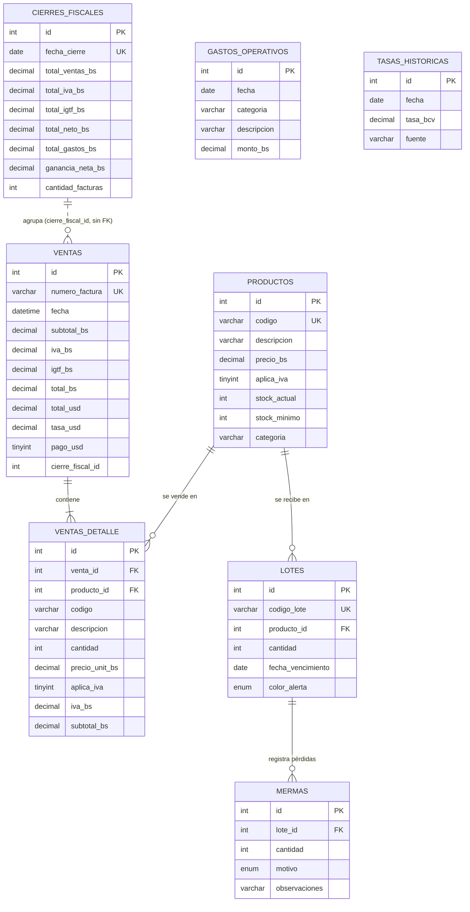

# Diagrama Entidad-Relación (SIGA, MySQL `siga_db`)

Refleja exactamente `siga/schema.sql` (8 tablas). No existe tabla de usuarios: el administrador se define por variables de entorno (`siga/.env`).

Notas:
- `gastos_operativos` y `tasas_historicas` no tienen llaves foráneas; se consultan por fecha.
- `ventas.cierre_fiscal_id` es una referencia lógica sin `FOREIGN KEY` en el esquema.
- La web no usa MySQL: guarda los datos fiscales en `localStorage` (`taxStorage.ts`).
